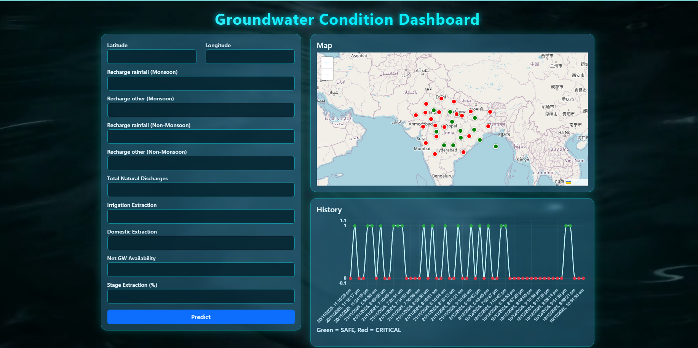
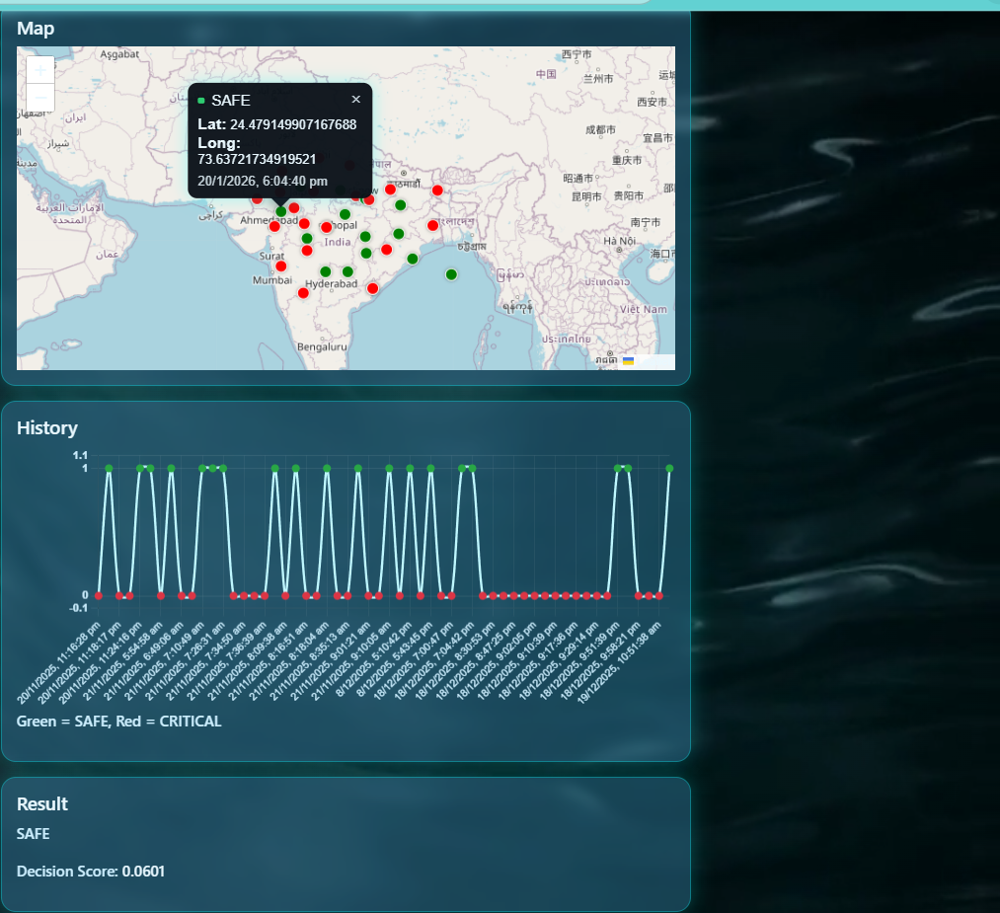

# 🌊 AquaSense — Groundwater Anomaly Detection System


**AquaSense** is a **machine learning–driven groundwater monitoring system** that detects **critical extraction and recharge anomalies** using real-world hydrological indicators.
It delivers **data-backed decision support** through a lightweight Flask web application powered by **unsupervised anomaly detection**.

> Designed for sustainability-focused analytics, environmental monitoring, and ML-powered decision systems.

## 📌 Problem Context

Groundwater is the backbone of **India’s drinking water supply, agriculture, and industrial demand**.
Yet, despite sustaining **~16% of the global population**, India possesses only **~4% of global freshwater resources**.

Unregulated extraction, seasonal imbalance, and delayed monitoring result in **severe groundwater stress**, often detected **after irreversible damage** has occurred.


## 🎯 Project Objectives

* Detect **abnormal groundwater extraction or recharge patterns**
* Classify regions into **SAFE** or **CRITICAL** categories
* Persist prediction history for **trend analysis**
* Provide a **REST API and web interface** for operational use
* Enable **early-warning signals** for policymakers and planners


## 🧠 Machine Learning Methodology

* **Model:** Isolation Forest (unsupervised anomaly detection)
* **Feature Scaling:** StandardScaler
* **Input Variables:** 9 groundwater indicators
* **Output Classification:**

  * `SAFE` — statistically normal groundwater behavior
  * `CRITICAL` — anomaly detected or threshold violation

This hybrid logic combines **statistical anomaly detection** with **domain-driven thresholds** for higher reliability.

---

## 📊 Groundwater Features Utilized

| Groundwater Indicators                             |
| -------------------------------------------------- |
| Recharge from rainfall (Monsoon)                   |
| Recharge from other sources (Monsoon)              |
| Recharge from rainfall (Non-Monsoon)               |
| Recharge from other sources (Non-Monsoon)          |
| Total Natural Discharges                           |
| Annual GW Extraction for Irrigation                |
| Annual GW Extraction for Domestic & Industrial Use |
| Net GW Availability for Future Use                 |
| Stage of Groundwater Extraction (%)                |

---

## 🧪 Decision Logic

A region is flagged as **CRITICAL** if **any** of the following conditions are met:

* Isolation Forest predicts an anomaly (`prediction = -1`)
* One or more indicators breach **predefined critical thresholds**

This dual-check mechanism minimizes false negatives in high-risk scenarios.

---

## 🏗️ System Architecture

```
Client (Web UI / REST API)
        |
        v
Flask Backend
        |
        ├── StandardScaler
        ├── Isolation Forest Model
        ├── SQLite (Prediction History)
        |
        v
JSON Response (SAFE / CRITICAL)
```

---

## 🛠️ Technology Stack

* **Backend:** Flask (Python)
* **Machine Learning:** scikit-learn, NumPy
* **Model Serialization:** Joblib
* **Database:** SQLite (auto-generated)
* **Deployment:** Render / Hugging Face Spaces
* **Configuration:** python-dotenv

---

## 📂 Project Structure

```
AquaSense/
│
├── app.py
├── requirements.txt
├── final_isolation_forest_model.pkl
├── scaler.pkl
├── predictions_history.db   # auto-generated (gitignored)
├── templates/
│   └── index.html
├── static/
├── Dataset.csv
├── .env
├── .gitignore
└── README.md
```

---

## 🚀 Installation & Local Setup

### 1️⃣ Clone the Repository

```bash
git clone https://github.com/<your-username>/AquaSense.git
cd AquaSense
```

### 2️⃣ Create a Virtual Environment

```bash
python -m venv venv
source venv/bin/activate      # Linux / macOS
venv\Scripts\activate         # Windows
```

### 3️⃣ Install Dependencies

```bash
pip install -r requirements.txt
```

### 4️⃣ Run the Application

```bash
python app.py
```

**Local Server:**

```
http://localhost:7860
```


## 🗄️ Database Behavior

* SQLite database is **auto-created**
* Each `/predict` request is persisted
* Database file is **excluded from Git**
* Suitable for **ephemeral cloud deployments**


## 📸 Screenshots

```md


```

---
## Live Visualization Link :-  
https://aquasense-hzc0.onrender.com/

## 📜 License

Licensed under the **Apache License 2.0**
Refer to the `LICENSE` file for full terms.

---

## 👤 Author

**NeuralCoder0**
---B.Tech (CSE) — Machine Learning & Data Systems

Focused on **ML-driven sustainability**, **data engineering**, and **real-world impact systems**.


